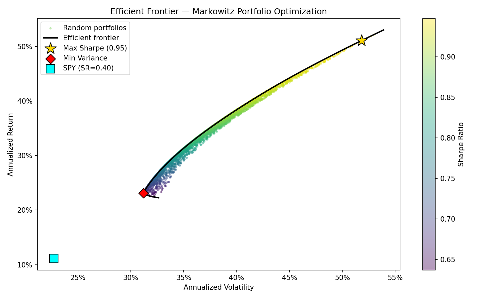

# Markowitz Portfolio Optimizer

A Python CLI tool for portfolio risk analysis and asset allocation optimization based on Modern Portfolio Theory (MPT).

---

## Description

This tool downloads historical price data, computes key portfolio metrics, and identifies optimal asset allocations using mean-variance optimization. It generates an efficient frontier plot and prints the maximum Sharpe Ratio and minimum variance portfolios directly to the terminal.

---

## Key Features

- Downloads historical adjusted prices via `yfinance`
- Computes logarithmic returns, annualized expected returns, and covariance matrix
- Finds the **maximum Sharpe Ratio** portfolio using `scipy.optimize.minimize`
- Finds the **minimum variance** portfolio
- Runs **Monte Carlo simulations** to visualize the portfolio space
- Plots the **efficient frontier** and saves it as a `.png` file
- Clean CLI interface with `argparse`

---

## Project Structure

```
.
├── data_loader.py    # Downloads and cleans historical price data
├── metrics.py        # Computes returns, covariance, and portfolio statistics
├── optimizer.py      # Optimization logic and efficient frontier calculation
├── main.py           # CLI entry point and workflow orchestration
├── outputs/          # Generated plots are saved here
└── requirements.txt
```

---

## Installation

**Requirements:** Python 3.10+

```bash
git clone https://github.com/your-username/markowitz-portfolio-optimizer.git
cd markowitz-portfolio-optimizer
pip install -r requirements.txt
```

---

## Usage

```bash
python main.py --tickers AAPL MSFT NVDA --start 2020-01-01 --end 2024-01-01 --risk-free-rate 0.02 --simulations 5000
```

### Arguments

| Argument | Description | Default |
|---|---|---|
| `--tickers` | Space-separated list of ticker symbols | required |
| `--start` | Start date (YYYY-MM-DD) | required |
| `--end` | End date (YYYY-MM-DD) | required |
| `--risk-free-rate` | Annual risk-free rate as a decimal | `0.0` |
| `--simulations` | Number of random portfolios to simulate | `10000` |

---

## Outputs

- **Terminal:** Prints the weights, expected return, volatility, and Sharpe Ratio for both optimal portfolios.
- **`outputs/efficient_frontier.png`:** Scatter plot of simulated portfolios colored by Sharpe Ratio, with the efficient frontier curve and both optimal portfolios highlighted.

---

## Financial Methodology

**Logarithmic Returns**
Daily log returns are computed as `ln(P_t / P_{t-1})`. Log returns are time-additive and better suited for multi-period analysis than simple returns.

**Annualized Covariance Matrix**
The sample covariance of daily log returns is scaled by 252 (trading days per year) to produce annualized figures, capturing how assets move together over time.

**Sharpe Ratio**
Measures risk-adjusted return: `(portfolio return - risk-free rate) / portfolio volatility`. A higher Sharpe Ratio indicates better compensation per unit of risk taken.

**Minimum Variance Portfolio**
The portfolio with the lowest achievable volatility given the asset universe, regardless of expected return. Useful as a baseline for risk-averse allocation.

**Efficient Frontier**
The set of portfolios that maximize expected return for each level of volatility. Portfolios below the frontier are suboptimal — they carry more risk for the same return, or less return for the same risk.

---

## Disclaimer

This project is for **educational purposes only** and does not constitute financial advice. Past performance is not indicative of future results. Do not make investment decisions based on this tool.
